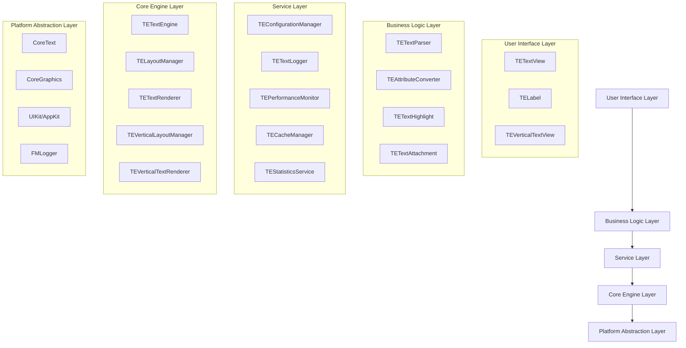
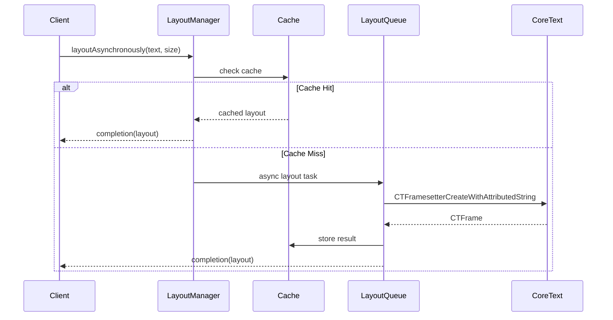
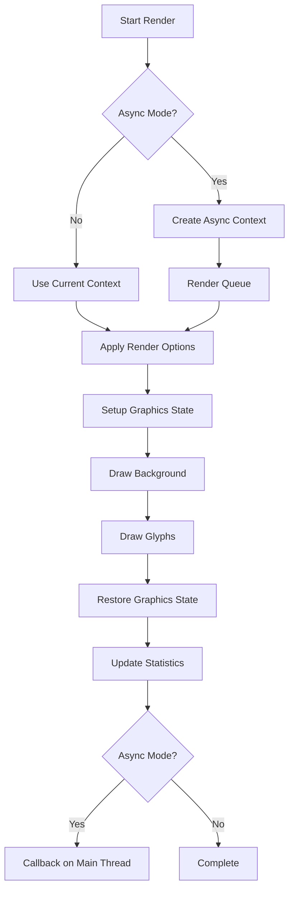

# TextEngineKit 技术架构设计文档

## 1. 架构设计

### 1.1 整体架构图



### 1.2 依赖注入架构

```mermaid
graph TD
    A[TETextEngine] --> B[TEContainer]
    B --> C[TEConfigurationManager]
    B --> D[TETextLogger]
    B --> E[TEPerformanceMonitor]
    B --> F[TECacheManager]
    B --> G[TEStatisticsService]
    B --> H[TELayoutService]
    B --> I[TERenderingService]
    B --> J[TEParsingService]
    
    K[@Injected] -.-> B
    L[@ThreadSafe] -.-> A
```

## 2. 技术描述

### 2.1 核心技术栈

- **编程语言**: Swift 5.5+
- **最低支持版本**: iOS 13.0 / macOS 10.15
- **核心框架**: 
  - CoreText (文本布局和渲染)
  - CoreGraphics (图形渲染)
  - Foundation (基础功能)
- **日志系统**: FMLogger 1.0.0+
- **架构模式**: 依赖注入 + 协议导向设计
- **并发模型**: GCD (Grand Central Dispatch)
- **缓存机制**: NSCache + 自定义缓存策略

### 2.2 第三方依赖

```swift
// Package.swift 依赖配置
dependencies: [
    .package(url: "https://github.com/fengmingdev/FMLogger.git", from: "1.0.0")
]
```

## 3. 核心组件设计

### 3.1 引擎架构对比

#### 3.1.1 单例模式引擎 (TETextEngine)

```swift
public final class TETextEngine {
    // 单例实例
    public static let shared = TETextEngine()
    
    // 核心属性
    private let logger: FMLogger
    public var configuration: TEConfiguration
    
    // 性能监控
    public func logPerformance(_ operation: String, duration: TimeInterval)
    public func logLayoutPerformance(operation: String, textLength: Int, duration: TimeInterval, cacheHit: Bool)
}
```

**优点**:
- 简单易用，全局访问
- 适合小型项目和快速集成
- 内置完整的日志和性能监控

**缺点**:
- 紧耦合，测试困难
- 扩展性有限
- 不利于模块化开发

#### 3.1.2 依赖注入引擎 (TETextEngineRefactored)

```swift
public final class TETextEngine: TETextEngineProtocol {
    // 依赖注入属性
    @Injected private var configurationManager: TEConfigurationManagerProtocol
    @Injected private var logger: TETextLoggerProtocol
    @Injected private var performanceMonitor: TEPerformanceMonitorProtocol
    @Injected private var cacheManager: TECacheManagerProtocol
    
    // 线程安全状态
    @ThreadSafe private var _isRunning: Bool = false
    @ThreadSafe private var _configuration: TEConfiguration
    
    // 生命周期管理
    public func start() throws
    public func stop()
    public func reset()
    public func performHealthCheck() -> Result<Bool, TETextEngineError>
}
```

**优点**:
- 松耦合，易于测试
- 高度可扩展和配置
- 支持Mock和Stub
- 更好的错误处理和恢复

**缺点**:
- 复杂度较高
- 学习成本增加
- 初始化开销较大

### 3.2 布局管理系统

#### 3.2.1 TELayoutManager 架构

```swift
public final class TELayoutManager {
    // 核心组件
    private var layoutCache = NSCache<NSString, TELayoutInfo>()
    private let layoutQueue: DispatchQueue
    private let semaphore: DispatchSemaphore
    private let lock = NSLock()
    
    // 布局方法
    public func layoutSynchronously(_ attributedString: NSAttributedString, size: CGSize) -> TELayoutInfo
    public func layoutAsynchronously(_ attributedString: NSAttributedString, size: CGSize, completion: @escaping (TELayoutInfo) -> Void)
    
    // 缓存管理
    private func generateCacheKey(attributedString: NSAttributedString, container: TETextContainer, options: TELayoutOptions) -> NSString
    private func performLayout(attributedString: NSAttributedString, container: TETextContainer, options: TELayoutOptions) -> TELayoutInfo
}
```

#### 3.2.2 异步布局流程



### 3.3 文本容器设计

#### 3.3.1 TETextContainer 特性

```swift
public final class TETextContainer: NSObject, NSCopying, NSSecureCoding {
    // 几何属性
    public var size: CGSize = .zero
    public var insets: TEUIEdgeInsets = TEUIEdgeInsets(top: 0, left: 0, bottom: 0, right: 0)
    
    // 路径支持
    public var path: CGPath?  // 自定义布局路径
    public var exclusionPaths: [CGPath] = []  // 排除路径
    
    // 排版控制
    public var maximumNumberOfLines: Int = 0
    public var lineBreakMode: CTLineBreakMode = .byWordWrapping
    public var textAlignment: CTTextAlignment = .natural
    
    // 便利方法
    public func setCircularPath(center: CGPoint, radius: CGFloat)
    public func setRoundedRectPath(_ rect: CGRect, cornerRadius: CGFloat)
    public func setBezierPath(_ bezierPath: UIBezierPath)
}
```

#### 3.3.2 路径计算算法

```swift
private func effectivePath() -> CGPath {
    guard let path = path else {
        return createDefaultPath()  // 默认矩形路径
    }
    
    // 应用内边距变换
    if insets.top == 0 && insets.left == 0 && insets.bottom == 0 && insets.right == 0 {
        return path
    }
    
    // 计算内边距后的有效路径
    let bounds = pathBoundsCache
    let insetBounds = CGRect(
        x: bounds.origin.x + insets.left,
        y: bounds.origin.y + insets.top,
        width: bounds.size.width - insets.left - insets.right,
        height: bounds.size.height - insets.top - insets.bottom
    )
    
    return createPathFromRect(insetBounds)
}
```

### 3.4 渲染系统

#### 3.4.1 渲染架构

```swift
public final class TETextRenderer {
    // 渲染模式
    private let enableAsyncRendering: Bool
    private let renderQueue: DispatchQueue
    private let lock = NSLock()
    
    // 渲染方法
    public func renderSynchronously(_ attributedString: NSAttributedString, in context: CGContext, rect: CGRect)
    public func renderAsynchronously(_ attributedString: NSAttributedString, size: CGSize, completion: @escaping (TEImage?) -> Void)
    
    // 性能统计
    private var renderStatistics = TERenderStatistics()
    
    // 渲染选项
    public struct TERenderOptions: OptionSet {
        public static let antialiased = TERenderOptions(rawValue: 1 << 0)
        public static let transparentBackground = TERenderOptions(rawValue: 1 << 1)
        public static let subpixelPositioning = TERenderOptions(rawValue: 1 << 2)
        public static let highQuality: TERenderOptions = [.antialiased, .subpixelPositioning]
    }
}
```

#### 3.4.2 渲染流程



## 4. 线程安全设计

### 4.1 线程安全机制

#### 4.1.1 NSLock 使用

```swift
// 统计信息获取 - 线程安全
public func getStatistics() -> TELayoutStatistics {
    lock.lock()
    defer { lock.unlock() }
    return layoutStatistics
}

// 缓存更新 - 线程安全
private func updateStatistics(hit: Bool, duration: TimeInterval) {
    lock.lock()
    defer { lock.unlock() }
    
    if hit {
        layoutStatistics.cacheHits += 1
    } else {
        layoutStatistics.cacheMisses += 1
    }
    // ... 其他统计更新
}
```

#### 4.1.2 @ThreadSafe 属性包装器

```swift
@propertyWrapper
public struct ThreadSafe<T> {
    private var value: T
    private let lock = NSLock()
    
    public var wrappedValue: T {
        get {
            lock.lock()
            defer { lock.unlock() }
            return value
        }
        set {
            lock.lock()
            defer { lock.unlock() }
            value = newValue
        }
    }
}

// 使用示例
@ThreadSafe private var _isRunning: Bool = false
@ThreadSafe private var _configuration: TEConfiguration
```

### 4.2 并发控制

#### 4.2.1 信号量控制

```swift
public func layoutAsynchronously(
    _ attributedString: NSAttributedString,
    size: CGSize,
    completion: @escaping (TELayoutInfo) -> Void
) {
    layoutQueue.async { [weak self] in
        guard let self = self else { return }
        
        self.semaphore.wait()  // 获取信号量
        
        // 执行布局计算
        let layoutInfo = self.performLayout(attributedString: attributedString, size: size)
        
        self.semaphore.signal()  // 释放信号量
        
        DispatchQueue.main.async {
            completion(layoutInfo)
        }
    }
}
```

#### 4.2.2 双重检查锁定

```swift
// 异步布局中的双重检查
layoutQueue.async { [weak self] in
    guard let self = self else { return }
    
    self.semaphore.wait()
    
    // 再次检查缓存（双重检查模式）
    if let cachedLayout = self.layoutCache.object(forKey: cacheKey) {
        self.semaphore.signal()
        DispatchQueue.main.async {
            completion(cachedLayout)
        }
        return
    }
    
    // 执行实际布局
    let layoutInfo = self.performLayout(attributedString: attributedString, size: size)
    self.layoutCache.setObject(layoutInfo, forKey: cacheKey)
    
    self.semaphore.signal()
    
    DispatchQueue.main.async {
        completion(layoutInfo)
    }
}
```

## 5. 错误处理系统

### 5.1 统一错误类型

```swift
public enum TETextEngineError: Error, LocalizedError {
    // 布局相关错误
    case invalidTextRange(range: NSRange, totalLength: Int)
    case layoutFailure(reason: String, textLength: Int)
    case invalidContainerSize(size: CGSize)
    
    // 渲染相关错误
    case renderingFailure(reason: String, contextInfo: String)
    case graphicsContextError(reason: String)
    
    // 系统相关错误
    case memoryWarning(currentUsage: Int, threshold: Int)
    case threadSafetyViolation(operation: String)
    
    // 本地化描述
    public var errorDescription: String? {
        switch self {
        case .invalidTextRange(let range, let totalLength):
            return "文本范围 \(range) 超出总长度 \(totalLength)"
        // ... 其他错误描述
        }
    }
}
```

### 5.2 错误恢复机制

```swift
public extension TETextEngineError {
    /// 获取错误恢复建议
    var recoverySuggestion: String? {
        switch self {
        case .invalidTextRange:
            return "请检查文本范围参数，确保在有效范围内"
        case .layoutFailure:
            return "请检查文本内容和容器尺寸设置"
        case .memoryWarning:
            return "请释放内存或减少内存使用"
        default:
            return "请联系技术支持"
        }
    }
    
    /// 判断是否为可恢复错误
    var isRecoverable: Bool {
        switch self {
        case .invalidTextRange, .invalidContainerSize, .invalidParameter:
            return true
        default:
            return false
        }
    }
}
```

## 6. 性能优化策略

### 6.1 缓存优化

#### 6.1.1 多级缓存架构

```swift
// 一级缓存：内存缓存（NSCache）
private var layoutCache = NSCache<NSString, TELayoutInfo>()

// 二级缓存：磁盘缓存（可选）
private var diskCache: TEDiskCache?

// 三级缓存：网络缓存（可选）
private var networkCache: TENetworkCache?
```

#### 6.1.2 智能缓存键生成

```swift
private func generateCacheKey(
    attributedString: NSAttributedString,
    container: TETextContainer,
    options: TELayoutOptions
) -> NSString {
    let stringHash = attributedString.hash
    let sizeHash = container.size.width.hashValue ^ container.size.height.hashValue
    let optionsHash = options.rawValue.hashValue
    let pathHash = container.path?.boundingBox.hashValue ?? 0
    let exclusionHash = container.exclusionPaths.count.hashValue
    
    return "\(stringHash)_\(sizeHash)_\(optionsHash)_\(pathHash)_\(exclusionHash)" as NSString
}
```

### 6.2 异步处理优化

#### 6.2.1 任务队列管理

```swift
// 优先级队列设计
private let layoutQueue = DispatchQueue(
    label: "com.textenginekit.layout",
    qos: .userInitiated,  // 用户发起的操作，高优先级
    attributes: .concurrent  // 支持并发执行
)

// 限制并发数
private let semaphore = DispatchSemaphore(value: maxConcurrentTasks)
```

#### 6.2.2 性能统计收集

```swift
public struct TELayoutStatistics {
    public var totalLayoutCount: Int = 0
    public var cacheHits: Int = 0
    public var cacheMisses: Int = 0
    public var totalLayoutTime: TimeInterval = 0
    public var averageLayoutTime: TimeInterval = 0
    
    public var cacheHitRate: Double {
        let total = cacheHits + cacheMisses
        return total > 0 ? Double(cacheHits) / Double(total) * 100 : 0
    }
}
```

## 7. 扩展性设计

### 7.1 插件架构

```swift
public protocol TETextEnginePlugin {
    func initialize(with engine: TETextEngine)
    func process(_ text: String) -> String
    func supportedFormats() -> [String]
}

public final class TEPluginManager {
    private var plugins: [String: TETextEnginePlugin] = [:]
    
    public func register(_ plugin: TETextEnginePlugin, for format: String) {
        plugins[format] = plugin
    }
    
    public func process(_ text: String, format: String) -> String {
        guard let plugin = plugins[format] else {
            return text
        }
        return plugin.process(text)
    }
}
```

### 7.2 自定义属性支持

```swift
public struct TEAttributeKey {
    // 标准CoreText属性
    public static let font = NSAttributedString.Key("TEFontAttribute")
    public static let foregroundColor = NSAttributedString.Key("TEForegroundColorAttribute")
    
    // TextEngineKit扩展属性
    public static let textBorder = NSAttributedString.Key("TETextBorderAttribute")
    public static let textShadow = NSAttributedString.Key("TEShadowAttribute")
    public static let textHighlight = NSAttributedString.Key("TETextHighlightAttribute")
    
    // 支持自定义属性注册
    private static var customAttributes: [String: NSAttributedString.Key] = [:]
    
    public static func registerCustomAttribute(_ key: String) -> NSAttributedString.Key {
        let attributeKey = NSAttributedString.Key(key)
        customAttributes[key] = attributeKey
        return attributeKey
    }
}
```

## 8. 部署和集成

### 8.1 Swift Package Manager 集成

```swift
// Package.swift
dependencies: [
    .package(url: "https://github.com/yourusername/TextEngineKit.git", from: "1.0.0")
]

targets: [
    .target(
        name: "YourApp",
        dependencies: ["TextEngineKit"]
    )
]
```

### 8.2 CocoaPods 集成（可选）

```ruby
# Podfile
pod 'TextEngineKit', '~> 1.0'
```

### 8.3 基本使用示例

```swift
import TextEngineKit

// 基础使用
let label = TELabel()
label.text = "Hello, TextEngineKit!"
label.font = .systemFont(ofSize: 16)
view.addSubview(label)

// 高级使用（依赖注入）
let engine = TETextEngine()
try engine.start()

let result = engine.processText("# Markdown Title\n\nContent here...")
switch result {
case .success(let attributedString):
    textView.attributedText = attributedString
case .failure(let error):
    print("Processing failed: \(error)")
}
```

## 9. 监控和运维

### 9.1 性能监控

```swift
// 实时性能监控
public protocol TEPerformanceMonitorProtocol {
    func measure<T>(operation: String, _ block: () throws -> T) rethrows -> T
    func getStatistics() -> PerformanceStatistics
    func reset()
}

// 使用示例
let monitor = TEPerformanceMonitor()
let result = monitor.measure(operation: "text_layout") {
    return layoutManager.layoutSynchronously(text, size: size)
}
```

### 9.2 日志监控

```swift
// 集成FMLogger
TETextEngine.shared.logDebug("Debug message", category: "text_processing")
TETextEngine.shared.logWarning("Warning message", category: "performance")
TETextEngine.shared.logError("Error message", category: "rendering")

// 性能日志
TETextEngine.shared.logLayoutPerformance(
    operation: "async_layout",
    textLength: text.count,
    duration: duration,
    cacheHit: true
)
```

### 9.3 健康检查

```swift
public func performHealthCheck() -> Result<Bool, TETextEngineError> {
    do {
        let configHealth = try configurationManager.validateConfiguration(_configuration)
        let cacheHealth = cacheManager.healthCheck()
        let performanceHealth = performanceMonitor.isHealthy()
        
        let overallHealth = configHealth && cacheHealth && performanceHealth
        return .success(overallHealth)
    } catch {
        return .failure(.healthCheckFailure(reason: error.localizedDescription))
    }
}
```

## 10. 总结

TextEngineKit的技术架构设计体现了现代化iOS框架的最佳实践：

1. **模块化设计**: 清晰的分层架构，职责分离
2. **协议导向**: 高度可扩展的协议体系
3. **依赖注入**: 松耦合的服务架构
4. **线程安全**: 完整的并发安全设计
5. **性能优化**: 多层次的性能优化策略
6. **企业级特性**: 完整的监控、日志和错误处理

该架构不仅满足了当前的功能需求，也为未来的扩展和演进提供了坚实的基础。